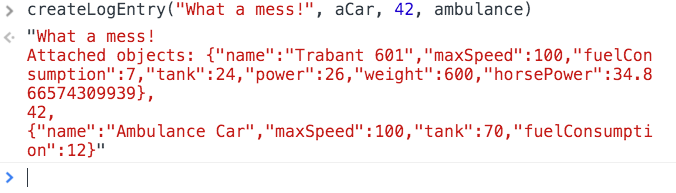
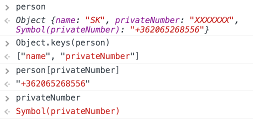

name: es6
class: center, middle

# The state of ECMAScript 6

---
# ES6 support


As of 30/03/2017 Source: http://kangax.github.io/compat-table/es6/

---
# Transpilers

- JavaScript to JavaScript compilers
- ES6 => ES5

- Babel https://babeljs.io/
- Traceur https://github.com/google/traceur-compiler

---
# Babel


```
$ npm init
$ npm install --save-dev babel-cli babel-preset-es2015 babel-polyfill
```

```
// package.json
...
  "scripts": {
    "build": "babel src -d lib --source-maps",
    "watch": "babel src -d lib --source-maps --watch"
  },
...
```

```
{// .babelrc
  "presets": ["es2015"]
}
```

```
<script src="node_modules/babel-polyfill/dist/polyfill.min.js"></script>
```

```
$ npm run build
```

---
# Block scope I: let

```
function getValue(condition) {
  if (condition) {
    let value = "blue";
    return value;
  } else {
    // value doesn't exist here
    return null;
  }
  // value doesn't exist here
}

for (let i=0; i < 10; i++) {
  process(items[i]);
}

//i doesn't exist here

```

.attribution[Some ES6 examples adapted from the book [Understanding ECMAScript 6](https://leanpub.com/understandinges6/read) by Nicholas C. Zakas] 

---
# Block scope II: const

```
function calcGForce() {
  const G = 6.674e-11;
  const sun = {
    m: 1.98855e33
  };

  sun.m += 5e28;

  sun = { //throws error
    m: 1e34
  };
}
```

- Hint: Use `const` as default, switch to `let` if needed. You never really need `var`.
- Note: The reference is constant, not the value. Use `Object.freeze()` to prevent modification of properties.

---
# Block scope III: loops

```
var funcs = [];

for (let i=0; i < 10; i++) {
    funcs.push(function() {
        console.log(i);
    });
}

function printFuncs() {
  funcs.forEach(function (func) {
    func();
  })
}
```

- This doesn't work with `var`.
- `let` creates a new variable in every cycle.

---
# Default parameters

```
function makeRequest(url, timeout = 2000, callback) {
  console.log("url: " + url);
  console.log("timeout: " + timeout);
  console.log("callback: " + callback);
}
```


---
# Rest parameters

```
function createLogEntry(message, ...objects) {
  var printedObjects = objects.map(function(object) {
    return JSON.stringify(object);
  }).join(",\n");
  return `${message}\nAttached objects: ${printedObjects}`;
}
```



---

# The spread operator

```
let nums = [25, 50, 75, 100]

Math.max(...nums);// 100

// Equivalent to:
Math.max.apply(Math, nums);


//But even:
Math.max(...nums, 110);// 110
```

---
# Template literals

```
console.log(`string text line 1
string text line 2`);
```

```
var a = 5;
var b = 10;
console.log(`Fifteen is ${a + b} and not ${2 * a + b}.`);

//Fifteen is 15 and not 20.
```

---
# Tagged template literals

```
function upper(strings, ...keys) {
  return (function(...values) {
    var result = [strings[0]];
    keys.forEach(function(key, i) {
      result.push(String(values[key]).toUpperCase(), strings[i + 1]);
    });
    return result.join('');
  });
}
```

```
var hello = upper`Hello ${0}!`;
hello('World');

//"Hello WORLD!"
```

---

# Arrow functions

```
function createLogEntryA(message, ...objects) {
  var printedObjects = objects.map(object => JSON.stringify(object))
    .join(",\n");
  return `${message}\nAttached objects: ${printedObjects}`;
}
```

- No `this`, `super`, `arguments` bindings
- Cannot be called with `new`; no `prototype` property

```
const sumA = (num1, num2) => {
    return num1 + num2;
};

const doNothing = () => {};

const getTempItem = id => ({ id: id, name: "Temp" });
```

---

# Tail call optimization - not yet implemented

```
function sumOneTo(n) {
  if (n === 1) {
    return 1;
  }
  return n + sumOneTo(n - 1);
}
```

```
function tailedSumOneTo(n, sum = 0) {
  if (n === 1) {
    return sum + 1;
  }
  return tailedSumOneTo(n - 1, sum + n);
}
```

---

# Object literal extensions

```
const generateId = (() => {
  let id = 0;
  return function generateId() {
    return id++;
  };
})();
```

```
function createPerson(firstName, lastName, idField = "id") {
  return {
    firstName,
    lastName,
    get fullName(){
      return `${firstName} ${lastName}`;
    },
    toString() {
      return `[Person] ${this.fullName}`;
    },
    [idField]: generateId()
  };
}
```

---

# Destructuring 

```
let {firstName, lastName} = createPerson("S", "K");

const {firstName: fn, lastName: ln} = createPerson("Schäffer", "K");

({firstName, lastName} = createPerson("A", "B"));
```

```
let names = [ "firstName", "lastName", "C" ];

let [ firstN, secondN ] = names;

let [ , , thirdN ] = names;

[ firstN, secondN ] = [ secondN, firstN ];
```

---

# Destructuring parameters

```
function setCookie(name, value, {
  secure, path, domain, expires
} = {
  path: "/"
}) {
  console.log("path: " + path);
}

setCookie("name", "value", {
  path: "/sdf"
});
```

---

# Class

```
var ES6 = {};

ES6.Car = class Car {
  constructor(name, maxSpeed, power, tank, fuelConsumption) {
    this.name = name;
    this.maxSpeed = maxSpeed;
    this.power = power;
    this.tank = tank;
    this.fuelConsumption = fuelConsumption;
  }

  getMaxRange () {
    return this.tank / this.fuelConsumption * 100;
  }
  
  get horsePower() {
    return this.power / ONE_HP_IN_KW;
  }
    
  set horsePower(hp) {
    this.power = hp * ONE_HP_IN_KW;
  }
};
```
---
# Inheritance: Derived classes

```
ES6.Ambulance = class Ambulance extends ES6.Car {
  constructor() {
    super("Ambulance Car", 100, 60, 70, 12);
    this.rangeFactor = 0.8;
  }
  
  getMaxRange() {
    return super.getMaxRange() * this.rangeFactor;
  }
  
  static staticFn() {
    console.log("Do Ambulance cars really need static members?");
  }
};
```

---

# class compatibility with ES5 OOP

```
function Car(name, maxSpeed, tank, fuelConsumption) {
  this.name = name;
  this.maxSpeed = maxSpeed;
  this.tank = tank;
  this.fuelConsumption = fuelConsumption;
}

...

class ECar extends Car {
  constructor() {
    super("ECar");
  }
}
```

---

#Symbols

```
const person = { name: "SK", privateNumber: "XXXXXXX"};

const privateNumber = Symbol("privateNumber");
person[privateNumber] = "+362065268556";
```



---

# The Symbol registry

```
const sharedPrivateNumber = Symbol.for("privateNumber");
person[sharedPrivateNumber] = "+363000000000";

const spn = Symbol.for("privateNumber");
```


---

# Iterators, for of

```
let onetwo = [1, 2];
let iterator = onetwo[Symbol.iterator]();

iterator.next(); // { value: 1, done: false }
iterator.next(); // { value: 2, done: false }
iterator.next(); // { value: undefined, done: true }
```

```
for (let num of onetwo) {
  console.log(num);
}
// 1
// 2
```

---

# Generators

```
function* everySecond(items) {
  for (let i = 0; i < items.length; i += 2) {
    yield items[i];
  }
}
```


---

# Iterable, complex example I.

```
const stepper = (() => {
  const items = Symbol("items");
  return function stepper(initItems = [], step = 1, skip = 0) {
    return {
      [items]: initItems,
      push(item) {
        this[items].push(item);
      },
      step,
      skip,
      * [Symbol.iterator]() {
        for (let i = this.skip; i < this[items].length; i += this.step) {
          yield this[items][i];
        }
      }
    };
  };
})();
```

---

# Iterable, complex example II.


---

# Modules I. Defining a module

```
export const G = 6.674e-11;

export class SpaceObject {
}

export default function simulate() {
}

function privateFn() {
}

function publicFn() {
}

export publicFn();
```

---

# Modules II. import

```
import sim from "space";
import { SpaceObject, G } from "space";
import * as space from "space";
import {publicFn as f} from "space";

sim(); // simulate()

SpaceObject;
G;

space.G;

f();

```

