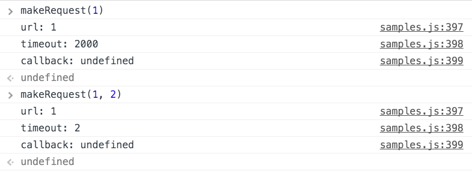

class: center, middle

# JavaScript: The Language

---

# Agenda

1. Functions
2. Collections
3. Objects & OOP
4. Operators
5. Modules
6. Error handling
7. Promises
8. Strict mode
9. The state of ECMAScript 6
10. The bad parts

---
class: center, middle

# 1. Functions

---

# Function declaration

```
function ackermann(m, n) {
  if (m === 0) {
    return n + 1;
  } else if (m > 0 && n === 0) {
    return ackermann(m - 1, 1);
  } else {
    return ackermann(m - 1, ackermann(m, n - 1));
  }
}
```


---

# Arguments

```
function sum() {
  var length = arguments.length;
  var retval = 0;
  for (var i = 0; i < length; ++i) {
    retval += arguments[i];
  }
  return retval;
}
```


.note[Note: arguments is an array-like object, not a real array. You should not call slice() on it. [more info](https://developer.mozilla.org/en-US/docs/Web/JavaScript/Reference/Functions/arguments)]

---
# No block scope: variable hoisting

```
function hoister() {
  console.log("x is " + x);
  x = -1;
  console.log("x is " + x);
  for (var i = 0; i < 3; ++i) {
    var x = i;
    console.log("x is now " + x);
  }
  console.log("window.x is " + window.x);
}
```

Will it run?

What's the output?
---

# Anonymous function stored in a variable

```
var ackermann3 = function (n) {
  return ackermann(3, n);
};
```


---

# Returning a function / closures I.

```
function ackermannX(m) {
  return function (n) {
    return ackermann(m, n);
  };
}
```


---

# Closures II.

```
function createFormatter(template) {
  return function formatter() {
    var i = arguments.length;
    var formatted = template;
    while (i >= 0) {
      formatted = formatted.replace("%" + (i + 1), arguments[i]);
      i--;
    }
    return formatted;
  };
}

function createLogger(template, targetElement) {
  var formatter = createFormatter(template);
  return function logger() {
    var logEntry = document.createElement("div");
    logEntry.textContent = formatter.apply(this, arguments);
    targetElement.appendChild(logEntry);
  };
}
```

---

# Closures in loops - this will not work
```
function setupHelp() {
  var helpText = [
      {'id': 'email', 'help': 'Your e-mail address'},
      {'id': 'name', 'help': 'Your full name'},
      {'id': 'age', 'help': 'Your age (you must be over 16)'}
    ];

  for (var i = 0; i < helpText.length; i++) {
    var item = helpText[i];
    document.getElementById(item.id).onfocus = function() {
      showHelp(item.help);
    }
  }
}
```
The variable *i* is shared between the event handlers. [jsfiddle](https://jsfiddle.net/v7gjv/light/)

To fix, separate the binding into a function to have a new closure. [fixed](https://jsfiddle.net/v7gjv/1/light/)

.attribution[Sample from [MDN](https://developer.mozilla.org/en-US/docs/Web/JavaScript/Closures)]

---
# Callbacks

Closures can be used to store state during asynchronous operations.

```
function loadSlides(url, cb) {
  $.get(url, function(data) {
    var slides = parseSlides(data);
    slides.sourceUrl = url;
    cb(slides);
  });
}
```

.note[Always call `cb` either synchronously or asynchronously. Do not mix. Use `setImmediate` if needed.]

---
class: center, middle

# 2. Collections

---
# every(), some(), forEach()

```
function isBigEnough(element, index, array) {
  return element >= 10;
}
[12, 5, 8, 130, 44].every(isBigEnough);   // false
[12, 54, 18, 130, 44].every(isBigEnough); // true

[12, 5, 8, 130, 44].some(isBigEnough); // true
```

```
function log(val) {
  console.log(val)
}
[12, 5, 8, 130, 44].forEach(log);
```

- There is no way to break `forEach`, you can use `every` or `some` instead.

---

# Array.map() I.

```
var numbers = [1, 4, 9];
var roots = numbers.map(Math.sqrt);
```


---
# Array.map() II.

```
var videos = [{id: 1, title: "Armageddon", year: "1998"},
              {id: 56, title: "Kopaszkutya", year: "1981"},
              {id: 281, title: "A mindenség elmélete", year: "2014"}];
              
var ids = videos.map(function (video) {
  return video.id;
});

var projected = videos.map(function (video) {
  return {
    id: video.id,
    title: video.title
  };
});

var typedVideos = videos.map(function (video) {
  return new Video(video);
});
```

.right[[workshop at reactivex.io](http://reactivex.io/learnrx/)]
---

# Array.filter()

```
var twentiestCenturyVideos = videos.filter(function (video) {
  return Number(video.year) <= 2000;
});
```


---

# Array.from()

`arguments` is not a real Array.

```
function createFormatter(template) {
  return function formatter() {
    var i = arguments.length;
    var formatted = template;
    while (i >= 0) {
      formatted = formatted.replace("%" + (i + 1), arguments[i]);
      i--;
    }
    return formatted;
  };
}

function createFormatter2(template) {
  return function formatter() {
    var formatted = template;
    Array.from(arguments).forEach(function (arg, idx) {
      formatted = formatted.replace("%" + (idx + 1), arg);
    });
    return formatted;
  };
}
```
---

# Array.reduce()

`arr.reduce(callback[, initialValue])`

Parameters

`callback`: Accumulator function to execute on each value in the array, taking four arguments:

- `previousValue`:
      The value previously returned in the last invocation of the callback, or initialValue, if supplied.
- `currentValue`:
    The current element being processed in the array.
- `currentIndex`:
    The index of the current element being processed in the array.
- `array`:
    The array reduce was called upon.

```
function createFormatter3(template) {
  return function formatter() {
    return Array.from(arguments).reduce(function (formatted, arg, idx) {
      return formatted.replace("%" + (idx + 1), arg);
    }, template);
  };
}
```

---

# Typed arrays I.: architecture


---

# Typed arrays II.: example

```
MandelWorker.prototype.calculate = function () {
  var buf = new ArrayBuffer(4 * this.width * this.height);
  var pix = new Uint8ClampedArray(buf);
  for (var ix = 0; ix < this.width; ++ix)
    for (var iy = 0; iy < this.height; ++iy) {
      var ppos = 4 * (this.width * iy + ix);
      ...
      pix[ppos] = 255;
      pix[ppos + 1] = 255 * (c - 1);
      pix[ppos + 2] = 0;
      ...
    };
  return pix;
};
```

---

# Set

```
var set = new Set();
set.add(5);
set.add("5");
set.add(5); // duplicate, ignored

set.size; // 2

console.log(set.has(5));    // true
console.log(set.has(6));    // false

set.delete(5);
set.size; // 1

var setFromArray = new Set([1, 5, 1, 6, 5, 9]);
setFromArray.size; // 4
```

ES6, but polyfills available
---

# Map

```
var map = new Map([["title", "Understanding ECMAScript 6"],
                 ["url", "https://leanpub.com/understandinges6/read"]]);

map.has("title"); // true
map.get("title"); // "Understanding ECMAScript 6"

map.forEach(function (value, key, ownerMap) {
  console.log(key + ": " + value);
});

map.delete("title");
map.size; // 1
```

- Key can be anything

---

# WeakSet, WeakMap

- Store object references only.
- Allows garbage collection.
- Entry will be deleted automatically if no strong reference remains to key.
- No `forEach()`, `size`, `clear()`.
- Associating data with DOM objects, caching, storing private data, etc.

---
class: center, middle

# 3. Objects & OOP

---

# Object Initialization

```
var ONE_HP_IN_KW = 0.745699872;

var aCar = {
  name: "Trabant 601",
  maxSpeed: 100,
  fuelConsumption: 7,
  tank: 24,
  power: 26,
  weight: 600,
  getMaxRange: function () {
    return this.tank / this.fuelConsumption * 100;
  },
  get horsePower() {
    return this.power / ONE_HP_IN_KW;
  },
  set horsePower(hp) {
    this.power = hp * ONE_HP_IN_KW;
  }
};
```

---
# for..in loop basics

```
for (var prop in aCar) {
  console.log("aCar." + prop + " = " + aCar[prop]);
}
```


- Do not depend on the order, arbitrary and may change after `delete`!
- Do not use it on Arrays!

---
# Prototypes, Object.create()

```
var porsche = Object.create(aCar);
porsche.name = "Porsche 911 GT3";
porsche.power = 368;
porsche.weight = 1360;
porsche.fuelConsumption = 28;
porsche.tank = 120;
```


---
# for..in loop II.


- Iterates over enumerable properties
- `maxSpeed` is coming from the prototype chain
- Built-in properties of `Object` are not enumerable
- You can assign non-enumerable properties with `Object.defineProperty()`

---
# Object.keys()


- Lists own enumerable properties, excluding the ones in the prototype chain

Since JavaScript 1.8.5. A naive shim:

```
function listOwnProperties (obj) {
  var retval = [];
  for (var prop in obj) {
    if (obj.hasOwnProperty(prop)) {
      retval.push(prop);
    }
  }
  return retval;
}
```

In library code (still) recommended to use `hasOwnProperty` inside `for..in` loops. 
---
# delete and the prototype chain


---
# Contructor function, new operator

```
function Car(name, maxSpeed, tank, fuelConsumption) {
  this.name = name;
  this.maxSpeed = maxSpeed;
  this.tank = tank;
  this.fuelConsumption = fuelConsumption;
}

var subaru = new Car("Subaru WRX STI", 255);
```


---

# Constructor with prototype

```
Car.prototype.getMaxRange = function () {
  return this.tank / this.fuelConsumption * 100;
}

var lancer = new Car("Mitsubishi Lancer Evolution X", 260, 55, 14);
```


---

# Inheritance using a constructor

```
function Ambulance() {
  Car.call(this, "Ambulance Car", 100, 70, 12);
}

Ambulance.prototype = new Car();
Ambulance.prototype.constructor = Ambulance;

var ambulance = new Ambulance();
```


---

# A full example I/II.

```
function SpaceObject(pos, v, mass) {
  this.pos = pos;
  this.v = v;
  this.mass = mass || 1;
  this.stepForce = new Vector(0, 0);
  this.id = SpaceObject.getNextId();
}

/** Gravitational constant */
SpaceObject.G = 50;

/** Permeable objects are not involved in collision-like events */
SpaceObject.prototype.permeable = false;

/* @private */
SpaceObject.nextId = 1;

/* @private */
SpaceObject.getNextId = function () {
  return "SO" + (SpaceObject.nextId++);
};
```

---

# A full example II/II.

```
SpaceObject.prototype.oneStep = function () {
  this.v.add(this.stepForce.multiply(1 / this.mass));
  this.pos.add(this.v);
  this.heading += this.angularSpeed;
  this.stepForce = new Vector(0, 0);
};
```
```
function Detonation(pos, v) {
  SpaceObject.call(this, pos, v, -0.15);
  this.permeable = true;
  this.lifeSteps = 100;
}

Detonation.prototype = Object.create(SpaceObject.prototype);
Detonation.prototype.constructor = Detonation;

Detonation.prototype.oneStep = function () {
  this.stepForce = Vector.zero.clone();
  SpaceObject.prototype.oneStep.call(this);
  if (--this.lifeSteps <= 0) {
    this.die();
  }
};
```

---
# this I.

```
function ThisTest(id) {
  console.log("ThisTest: " + JSON.stringify(this));
  this.id = id;
}

ThisTest.prototype.test = function(arg1, arg2) {
  console.log("test: " + JSON.stringify(this) + " arg1: " +
                         arg1 + ", arg2: " + arg2);  
};
```

---
# this II.


---

# call, bind, apply


---

# Using bind


---
class: center, middle

# 4. A few operators

---
# typeof operator


Usable only for "primary" data types and for `undefined` checking

---
# instanceof operator


- Does not work across iframes!

---
# in operator

- Returns `true` if and only if the property name is enumerated in `for..in` loops
- Includes the prototype


---
class: center, middle

# 5. Modules in ECMAScript 5

---
# The 'jQuery' Module pattern

```
var file = (function file() {
  //private
  function normalize(url) {
  ...
  }

  function loadFile(url, cb) {
    var normalizedUrl = normalize(url);
    ...
  }

  //exports
  return { 
    loadFile: loadFile
  };
})();
```

.note[State and private functions are hiddenly stored in a closure.]

---
# Module pattern variant: locally scoped object

```
var file = (function file() {
  var exports = {};
  
  //private
  function normalize(url) {
  ...
  }

  exports.loadFile = function loadFile (url, cb) {
    var normalizedUrl = normalize(url);
    ...
  }

  return exports;
})();
```

---
# AMD - Asynchronous Module Definition

```
define("file", 
  ["storage", "stream"], 
  function (storage, stream) {
    function normalize(url) {
      ...
    }

    var file = {
      loadFile: function() {
        var normalizedUrl = normalize(url);
        ...
      }
    }

    return file;
});
```

```
require(["file", "stream"], function (file, stream) {
  file.loadFile(...);
});
```

.attribution[https://addyosmani.com/writing-modular-js/]

---
# CommonJS

```
var storage = require("packages/storage");
var stream = require("packages/stream");

function normalize(url) {
  ...
}

function loadFile(){
  var normalizedUrl = normalize(url);
  ...
}

exports.loadFile = loadFile;
```

```
var file = require("./file");
```

.note[Cleaner approach, but needs some (server-side) transformation to be usable in the browser.]

---
class: center, middle

# 6. Error Handling

---
# try, catch, throw, finally basics


---
# Custom Errors

Possible to subclass Error and check it with `instanceof` in `catch`. 

```
try {
  throw new CustomError("custom");
} catch (e) {
  if (e instanceof CustomError) {
    console.warn("CustomError", e);
  } else {
    console.warn("Unknown Error", e);
  }
}
```

---
# Custom Error implementation

To have correct stack trace in every browser, you need some trickery:

```
function CustomError(message, somethingElse) {
  var error = Error.call(this, message);

  this.name = this.constructor.name;
  this.message = error.message;
  this.stack = error.stack;
  
  this.customProperty = somethingElse;
}

CustomError.prototype = Object.create(Error.prototype);
CustomError.prototype.constructor = CustomError;
```

More on this: http://stackoverflow.com/questions/783818/how-do-i-create-a-custom-error-in-javascript

---
# Error handling in asynchronous code

Async code runs on its own stack, it is not possible to catch exceptions from the initiator code

```
try {
  $.get("index.html", function (data) {
    throw new Error("problem);
  });
} catch (e) {
  // will not catch the Error
}
```

---
# Ways to handle async errors I.

- Error callback
  - Separated error handler, like jQuery

```
    $.ajax({
      success: function (data, status, xhr) {...},
      error: function (xhr, status, error) {...}
    });
```
  - Using error object as first parameter of the callback, like Node.js

```
    db.fetch(query, function(err, result) {
      if (err) {
        ...
      }
    })
```

---
# Problems with callbacks and error handling

```
function getTotalFileLengths(path, callback) {
  fs.readdir(path, function (err, fileNames) {
    var total = 0;
    var finishedSoFar = 0;
    function finished() {
      if (++finishedSoFar === fileNames.length) {
        callback(total);
      }
    }
    fileNames.forEach(function (fileName) {
      fs.readFile(fileName, function (err, file) {
        total += file.length;
        finished();
      });
    });
  });
}
```

---
# Ways to handle async errors II.

- Higher level error handlers
  - global: `window.addEventListener("error", function (event) {...})`
  - domain: naive example: `$.ajaxError()`
- Promises

---
class: center, middle

# 7. Promises

---

# Promise example: fetch API usage

```
fetch('./api/some.json').then(function (response) {
      if (response.status != 200) {
        return Promise.reject("File not found: " + response.url);
      }
      return response.text();
    }).then(function(text) {
      return text.split("\n");
    }).then(console.log.bind(console))
    .catch(function(err) {  
      console.error('Fetch Error: ', err);  
    });
```

---
# A Promise

- Represents the result of an asynchronous operation.

- 3 states:
  - **pending**: The initial state, the operation hasn't completed yet, but is expected in the future.
  - **fulfilled**: The state representing a successful operation.
  - **rejected**: The state representing a failed operation.

---
# Using Promises gives you

- More readable code
  - `.then()` style looks similar to synchronous code
  - A way out of callback hell
- Error propagation similar to throw-catch-finally
- Easy parallel and sequential join
- Guarantees of no race conditions and immutability of the future value represented by the Promise (unlike callbacks and events)

---
# The secrets of Promise composition

```
getUserByName('nolan').then(function (user) {
  if (user.isLoggedOut()) {
    throw new Error('user logged out!'); // throwing a synchronous error
  }
  if (inMemoryCache[user.id]) {
    return inMemoryCache[user.id];       // returning a synchronous value
  }
  return getUserAccountById(user.id);    // returning a promise
}).then(function (userAccount) {
  // I got a user account
}).catch(function (err) {
  // I got an error
});
```

.attribution[http://pouchdb.com/2015/05/18/we-have-a-problem-with-promises.html]

---
# Parallel join: Promise.all()

Goal: Wait for multiple async operations, continue only when all of them completed.

```
db.allDocs({include_docs: true}).then(function (result) {
  return Promise.all(result.rows.map(function (row) {
    return db.remove(row.doc);
  }));
}).then(function (arrayOfResults) {
  // All docs have really been removed now
});
```

.attribution[http://pouchdb.com/2015/05/18/we-have-a-problem-with-promises.html]

Why not just use forEach?

```
db.allDocs({include_docs: true}).then(function (result) {
  return result.rows.forEach(function (row) {
    db.remove(row.doc);
  });
}).then(function () {
  // Possibly none of the rows are removed at this time
});
```

---
# Promise.reject(), Promise.resolve()

An unrealistic example of error propegation and handling

```
fetch('./api/some.json').then(function (response) {
      if (response.status != 200) {
        return Promise.reject("File not found: " + response.url);
      }
      return response.text();
    }).then(function (text) {
      console.log("Raw text: " + text);
      return text;
    }).catch(function(err) {  
      console.error('Fetch Error: ', err);  
      return Promise.resolve("Default value after error");
    }).then(function(text) {
      return text.split("\n");
    }).then(console.log.bind(console));
```

---
# Creating a Promise

If you are using `Promise` based APIs, you won't need this

```
function currentUserName() {
  return new Promise(function(resolve, reject) {
    function successHandler(user) {
      resolve(user.name);
    }
    
    $.ajax('current_user.json', {
      success: successHandler,
      error: reject,
      dataType: "JSON"
    })
  });
}
```

```
//Usage
currentUserName().then(loadSettings).then(...).catch(...);
```

---
# Promise drawbacks / nogoals

- Unhandled rejections are silently ignored. You will see _nothing_. => Always call `.catch()` at the end of the chain.
- Uncancellable.
- Will "fire" only once - not for events.
- Not possible to determine its state.

---
# Promise quiz

What happens here?

```
doSomething().then(function () {
  return doSomethingElse();
});
```

```
doSomething().then(function () {
  doSomethingElse();
});
```

```
doSomething().then(doSomethingElse());
```

```
doSomething().then(doSomethingElse);
```

.attribution[http://pouchdb.com/2015/05/18/we-have-a-problem-with-promises.html]

---
# Promise Puzzle solutions I.

```
doSomething().then(function () {
  return doSomethingElse();
}).then(finalHandler);
```

```
doSomething
|-----------------|
                  doSomethingElse(undefined)
                  |-----------------|
                                   finalHandler(resultOfDoSomethingElse)
                                   |------------------|
```

.attribution[http://pouchdb.com/2015/05/18/we-have-a-problem-with-promises.html]

---
# Promise Puzzle solutions II.

```
doSomething().then(function () {
  doSomethingElse();
}).then(finalHandler);
```

```
doSomething
|-----------------|
                  doSomethingElse(undefined)
                  |------------------|
                  finalHandler(undefined)
                  |------------------|
```

.attribution[http://pouchdb.com/2015/05/18/we-have-a-problem-with-promises.html]

---
# Promise Puzzle solutions III.

```
doSomething().then(doSomethingElse())
  .then(finalHandler);
```

```
doSomethingElse(undefined)
|---------------------------------|
doSomething
|-----------------|
                  finalHandler(resultOfDoSomething)
                  |------------------|
```

.attribution[http://pouchdb.com/2015/05/18/we-have-a-problem-with-promises.html]

---
# Promise Puzzle solutions IV.

```
doSomething().then(doSomethingElse)
  .then(finalHandler);
```

```
doSomething
|-----------------|
                  doSomethingElse(resultOfDoSomething)
                  |------------------|
                                     finalHandler(resultOfDoSomethingElse)
                                     |------------------|
```

.attribution[http://pouchdb.com/2015/05/18/we-have-a-problem-with-promises.html]

---
class: center, middle

# 8. Strict mode

---
# "use strict"

```
function strict(){
  "use strict";
  function nested() {
    return "And so am I!";
  }
  return "Hi!  I'm a strict mode function!  " + nested();
}

function notStrict() {
  return "I'm not strict.";
}
```

```
"use strict";

// strict mode in entire script
```

.note[Prefer the function scope, or you may have problems after script concatenation.]

---
# Strict mode

### Doesn't really affect the life of a good programmer. Turn it on!

- Makes it impossible to accidentally create global variables.
- Converts some silent fails to throw
  - assignment to a non-writable property
  - assignment to a getter-only property
  - assignment to a new property on a non-extensible object
  - deleting undeletable property
- Requires that all properties named in an object literal be unique.
- Requires that function parameter names be unique.
- Forbids octal syntax: `var x = 015; // this will throw in strict mode` 
- Prohibits `with`
- Eval of strict mode code does not introduce new variables into the surrounding scope.
- New reserved keywords.
- Some security related changes. (e.g. `this` won't be `window` if unspecified)
---
class: center, middle

# 9. The state of ECMAScript 6

---
# ES6 support


As of 18/01/2016. Source: http://kangax.github.io/compat-table/es6/

---
# Transpilers

- JavaScript to JavaScript compilers
- ES6 => ES5

- Babel https://babeljs.io/
- Traceur https://github.com/google/traceur-compiler

---
# Babel


```
$ npm init
$ npm install --save-dev babel-cli babel-preset-es2015 babel-polyfill
```

```
// package.json
...
  "scripts": {
    "build": "babel src -d lib --source-maps",
    "watch": "babel src -d lib --source-maps --watch"
  },
...
```

```
{// .babelrc
  "presets": ["es2015"]
}
```

```
<script src="node_modules/babel-polyfill/dist/polyfill.min.js"></script>
```

```
$ npm run build
```

---
# Block scope I: let

```
function getValue(condition) {
  if (condition) {
    let value = "blue";
    return value;
  } else {
    // value doesn't exist here
    return null;
  }
  // value doesn't exist here
}

for (let i=0; i < 10; i++) {
  process(items[i]);
}

//i doesn't exist here

```

.attribution[Some ES6 examples adapted from the book [Understanding ECMAScript 6](https://leanpub.com/understandinges6/read) by Nicholas C. Zakas] 

---
# Block scope II: const

```
function calcGForce() {
  const G = 6.674e-11;
  const sun = {
    m: 1.98855e33
  };

  sun.m += 5e28;

  sun = { //throws error
    m: 1e34
  };
}
```

- Hint: Use `const` as default, switch to `let` if needed. You never really need `var`.
- Note: The reference is constant, not the value. Use `Object.freeze()` to prevent modification of properties.

---
# Block scope III: loops

```
var funcs = [];

for (let i=0; i < 10; i++) {
    funcs.push(function() {
        console.log(i);
    });
}

function printFuncs() {
  funcs.forEach(function (func) {
    func();
  })
}
```

- This doesn't work with `var`.
- `let` creates a new variable in every cycle.

---
# Default parameters

```
function makeRequest(url, timeout = 2000, callback) {
  console.log("url: " + url);
  console.log("timeout: " + timeout);
  console.log("callback: " + callback);
}
```



---
# Rest parameters

```
function createLogEntry(message, ...objects) {
  var printedObjects = objects.map(function(object) {
    return JSON.stringify(object);
  }).join(",\n");
  return `${message}\nAttached objects: ${printedObjects}`;
}
```


---

# The spread operator

```
let nums = [25, 50, 75, 100]

Math.max(...nums);// 100

// Equivalent to:
Math.max.apply(Math, nums);


//But even:
Math.max(...nums, 110);// 110
```

---
# Template literals

```
console.log(`string text line 1
string text line 2`);
```

```
var a = 5;
var b = 10;
console.log(`Fifteen is ${a + b} and not ${2 * a + b}.`);

//Fifteen is 15 and not 20.
```

---
# Tagged template literals

```
function upper(strings, ...keys) {
  return (function(...values) {
    var result = [strings[0]];
    keys.forEach(function(key, i) {
      result.push(String(values[key]).toUpperCase(), strings[i + 1]);
    });
    return result.join('');
  });
}
```

```
var hello = upper`Hello ${0}!`;
hello('World');

//"Hello WORLD!"
```

---

# Arrow functions

```
function createLogEntryA(message, ...objects) {
  var printedObjects = objects.map(object => JSON.stringify(object))
    .join(",\n");
  return `${message}\nAttached objects: ${printedObjects}`;
}
```

- No `this`, `super`, `arguments` bindings
- Cannot be called with `new`; no `prototype` property

```
const sumA = (num1, num2) => {
    return num1 + num2;
};

const doNothing = () => {};

const getTempItem = id => ({ id: id, name: "Temp" });
```

---

# Tail call optimization - not yet implemented

```
function sumOneTo(n) {
  if (n === 1) {
    return 1;
  }
  return n + sumOneTo(n - 1);
}
```

```
function tailedSumOneTo(n, sum = 0) {
  if (n === 1) {
    return sum + 1;
  }
  return tailedSumOneTo(n - 1, sum + n);
}
```

---

# Object literal extensions

```
const generateId = (() => {
  let id = 0;
  return function generateId() {
    return id++;
  };
})();
```

```
function createPerson(firstName, lastName, idField = "id") {
  return {
    firstName,
    lastName,
    get fullName(){
      return `${firstName} ${lastName}`;
    },
    toString() {
      return `[Person] ${this.fullName}`;
    },
    [idField]: generateId()
  };
}
```

---

# Destructuring 

```
let {firstName, lastName} = createPerson("S", "K");

const {firstName: fn, lastName: ln} = createPerson("Schäffer", "K");

({firstName, lastName} = createPerson("A", "B"));
```

```
let names = [ "firstName", "lastName", "C" ];

let [ firstN, secondN ] = names;

let [ , , thirdN ] = names;

[ firstN, secondN ] = [ secondN, firstN ];
```

---

# Destructuring parameters

```
function setCookie(name, value, {
  secure, path, domain, expires
} = {
  path: "/"
}) {
  console.log("path: " + path);
}

setCookie("name", "value", {
  path: "/sdf"
});
```

---

# Class

```
var ES6 = {};

ES6.Car = class Car {
  constructor(name, maxSpeed, power, tank, fuelConsumption) {
    this.name = name;
    this.maxSpeed = maxSpeed;
    this.power = power;
    this.tank = tank;
    this.fuelConsumption = fuelConsumption;
  }

  getMaxRange () {
    return this.tank / this.fuelConsumption * 100;
  }
  
  get horsePower() {
    return this.power / ONE_HP_IN_KW;
  }
    
  set horsePower(hp) {
    this.power = hp * ONE_HP_IN_KW;
  }
};
```
---
# Inheritance: Derived classes

```
ES6.Ambulance = class Ambulance extends ES6.Car {
  constructor() {
    super("Ambulance Car", 100, 60, 70, 12);
    this.rangeFactor = 0.8;
  }
  
  getMaxRange() {
    return super.getMaxRange() * this.rangeFactor;
  }
  
  static staticFn() {
    console.log("Do Ambulance cars really need static members?");
  }
};
```

---

# class compatibility with ES5 OOP

```
function Car(name, maxSpeed, tank, fuelConsumption) {
  this.name = name;
  this.maxSpeed = maxSpeed;
  this.tank = tank;
  this.fuelConsumption = fuelConsumption;
}

...

class ECar extends Car {
  constructor() {
    super("ECar");
  }
}
```

---

#Symbols

```
const person = { name: "SK", privateNumber: "XXXXXXX"};

const privateNumber = Symbol("privateNumber");
person[privateNumber] = "+362065268556";
```


---

# The Symbol registry

```
const sharedPrivateNumber = Symbol.for("privateNumber");
person[sharedPrivateNumber] = "+363000000000";

const spn = Symbol.for("privateNumber");
```


---

# Iterators, for of

```
let onetwo = [1, 2];
let iterator = onetwo[Symbol.iterator]();

iterator.next(); // { value: 1, done: false }
iterator.next(); // { value: 2, done: false }
iterator.next(); // { value: undefined, done: true }
```

```
for (let num of onetwo) {
  console.log(num);
}
// 1
// 2
```

---

# Generators

```
function* everySecond(items) {
  for (let i = 0; i < items.length; i += 2) {
    yield items[i];
  }
}
```


---

# Iterable, complex example I.

```
const stepper = (() => {
  const items = Symbol("items");
  return function stepper(initItems = [], step = 1, skip = 0) {
    return {
      [items]: initItems,
      push(item) {
        this[items].push(item);
      },
      step,
      skip,
      * [Symbol.iterator]() {
        for (let i = this.skip; i < this[items].length; i += this.step) {
          yield this[items][i];
        }
      }
    };
  };
})();
```

---

# Iterable, complex example II.


---

# Modules I. Defining a module

```
export const G = 6.674e-11;

export class SpaceObject {
}

export default function simulate() {
}

function privateFn() {
}

function publicFn() {
}

export publicFn();
```

---

# Modules II. import

```
import sim from "space";
import { SpaceObject, G } from "space";
import * as space from "space";
import {publicFn as f} from "space";

sim(); // simulate()

SpaceObject;
G;

space.G;

f();

```

---
class: center, middle

# 10. The Bad Parts

---

# Global variables

- Scripts share a common execution context.
- Accidental declaration of global variables is possible
  - not in strict mode
- Name conflict is a real problem
  - Use namespace objects or modules
 
---

# Semicolon insertion

```
function returnObj() {
  return
  {
    status: true
  };
}
```


---

# type coercion, ==


Not transitive, avoid it. Use `===` and `!==`

---

# typeof, instanceof

Unreliable, as discussed earlier

---

# parseInt, parseFloat


Never use parseInt. Avoid parseFloat too. Use `Number()` instead.

---

# NaN


```
function isNumber(value) {
  return typeof value === 'number' && isFinite(value);
}
```

.attribution[Douglas Crockford: "JavaScript: The Good Parts"]

---

# Truthy & Falsy values


Be aware of it in condition evaluation!

---

# with statement

Just do not use it.

---

# eval

You never really need it. Turn it off using content security policy!

---

# void operator

Evaluates its operand but returns `undefined`. You don't really need it.


An old example:


```html
<a href="javascript:void(document.body.style.backgroundColor='green');">
  Click here for green background
</a>
```

.note[WARNING: Antipattern, never mix JavaScript and HTML]

---

