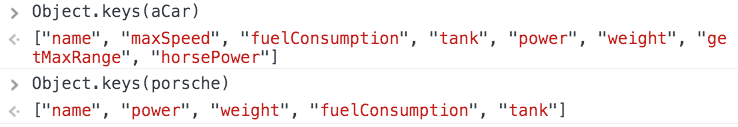
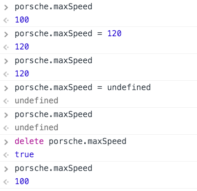
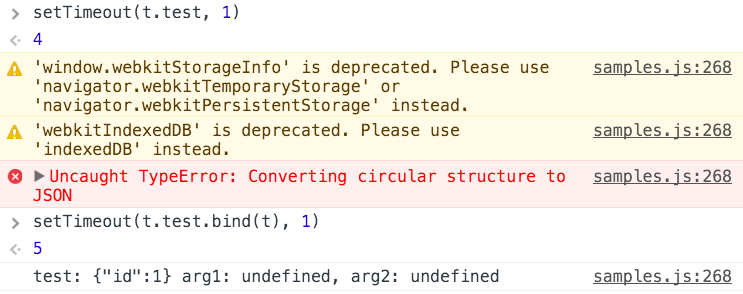

class: center, middle

# JavaScript: The Language

---

# Agenda

1. Functions
2. Collections
3. Objects & OOP
4. Operators
5. Error handling
6. Promises
7. Modules
8. Strict mode
9. The state of ECMAScript 6
10. The bad parts

---
class: center, middle

# 1. Functions

---

# Function declaration

```
function ackermann(m, n) {
  if (m === 0) {
    return n + 1;
  } else if (m > 0 && n === 0) {
    return ackermann(m - 1, 1);
  } else {
    return ackermann(m - 1, ackermann(m, n - 1));
  }
}
```


---

# Arguments

```
function sum() {
  var length = arguments.length;
  var retval = 0;
  for (var i = 0; i < length; ++i) {
    retval += arguments[i];
  }
  return retval;
}
```


.note[Note: arguments is an array-like object, not a real array. You should not call slice() on it. [more info](https://developer.mozilla.org/en-US/docs/Web/JavaScript/Reference/Functions/arguments)]

---
# No block scope: variable hoisting

```
function hoister() {
  console.log("x is " + x);
  x = -1;
  console.log("x is " + x);
  for (var i = 0; i < 3; ++i) {
    var x = i;
    console.log("x is now " + x);
  }
  console.log("window.x is " + window.x);
}
```

Will it run?

What's the output?
---

# Anonymous function stored in a variable

```
var ackermann3 = function (n) {
  return ackermann(3, n);
};
```


---

# Returning a function / closures I.

```
function ackermannX(m) {
  return function (n) {
    return ackermann(m, n);
  };
}
```


---

# Closures II.

```
function createFormatter(template) {
  return function formatter() {
    var i = arguments.length;
    var formatted = template;
    while (i >= 0) {
      formatted = formatted.replace("%" + (i + 1), arguments[i]);
      i--;
    }
    return formatted;
  };
}

function createLogger(template, targetElement) {
  var formatter = createFormatter(template);
  return function logger() {
    var logEntry = document.createElement("div");
    logEntry.textContent = formatter.apply(this, arguments);
    targetElement.appendChild(logEntry);
  };
}
```

---

# Closures in loops - this will not work
```
function setupHelp() {
  var helpText = [
      {'id': 'email', 'help': 'Your e-mail address'},
      {'id': 'name', 'help': 'Your full name'},
      {'id': 'age', 'help': 'Your age (you must be over 16)'}
    ];

  for (var i = 0; i < helpText.length; i++) {
    var item = helpText[i];
    document.getElementById(item.id).onfocus = function() {
      showHelp(item.help);
    }
  }
}
```
The variable *i* is shared between the event handlers. [jsfiddle](https://jsfiddle.net/v7gjv/light/)

To fix, separate the binding into a function to have a new closure. [fixed](https://jsfiddle.net/v7gjv/1/light/)

.attribution[Sample from [MDN](https://developer.mozilla.org/en-US/docs/Web/JavaScript/Closures)]

---
# Callbacks

Closures can be used to store state during asynchronous operations.

```
function loadSlides(url, cb) {
  $.get(url, function(data) {
    var slides = parseSlides(data);
    slides.sourceUrl = url;
    cb(slides);
  });
}
```

---
class: center, middle

# 2. Collections

---

# Array.map() I.

```
var numbers = [1, 4, 9];
var roots = numbers.map(Math.sqrt);
```


---
# Array.map() II.

```
var videos = [{id: 1, title: "Armageddon", year: "1998"},
              {id: 56, title: "Kopaszkutya", year: "1981"},
              {id: 281, title: "A mindenség elmélete", year: "2014"}];
              
var ids = videos.map(function (video) {
  return video.id;
});

var projected = videos.map(function (video) {
  return {
    id: video.id,
    title: video.title
  };
});

var typedVideos = videos.map(function (video) {
  return new Video(video);
});
```

.right[[workshop at reactivex.io](http://reactivex.io/learnrx/)]
---

# Array.filter()

```
var twentiestCenturyVideos = videos.filter(function (video) {
  return Number(video.year) <= 2000;
});
```


---

#Array.from()

`arguments` is not a real Array.

```
function createFormatter(template) {
  return function formatter() {
    var i = arguments.length;
    var formatted = template;
    while (i >= 0) {
      formatted = formatted.replace("%" + (i + 1), arguments[i]);
      i--;
    }
    return formatted;
  };
}

function createFormatter2(template) {
  return function formatter() {
    var formatted = template;
    Array.from(arguments).forEach(function (arg, idx) {
      formatted = formatted.replace("%" + (idx + 1), arg);
    });
    return formatted;
  };
}
```
---

#Array.reduce()

`arr.reduce(callback[, initialValue])`

Parameters

`callback`: Accumulator function to execute on each value in the array, taking four arguments:

- `previousValue`:
      The value previously returned in the last invocation of the callback, or initialValue, if supplied.
- `currentValue`:
    The current element being processed in the array.
- `currentIndex`:
    The index of the current element being processed in the array.
- `array`:
    The array reduce was called upon.

```
function createFormatter3(template) {
  return function formatter() {
    return Array.from(arguments).reduce(function (formatted, arg, idx) {
      return formatted.replace("%" + (idx + 1), arg);
    }, template);
  };
}
```

---

# Typed arrays I.: architecture


---

# Typed arrays II.: example

```
MandelWorker.prototype.calculate = function () {
  var buf = new ArrayBuffer(4 * this.width * this.height);
  var pix = new Uint8ClampedArray(buf);
  for (var ix = 0; ix < this.width; ++ix)
    for (var iy = 0; iy < this.height; ++iy) {
      var ppos = 4 * (this.width * iy + ix);
      ...
      pix[ppos] = 255;
      pix[ppos + 1] = 255 * (c - 1);
      pix[ppos + 2] = 0;
      ...
    };
  return pix;
};
```

---
class: center, middle

# 3. Objects & OOP

---

# Object Initialization

```
var ONE_HP_IN_KW = 0.745699872;

var aCar = {
  name: "Trabant 601",
  maxSpeed: 100,
  fuelConsumption: 7,
  tank: 24,
  power: 26,
  weight: 600,
  getMaxRange: function () {
    return this.tank / this.fuelConsumption * 100;
  },
  get horsePower() {
    return this.power / ONE_HP_IN_KW;
  },
  set horsePower(hp) {
    this.power = hp * ONE_HP_IN_KW;
  }
};
```

---
# for..in loop basics

```
for (var prop in aCar) {
  console.log("aCar." + prop + " = " + aCar[prop]);
}
```


- Do not depend on the order, arbitrary and may change after `delete`!
- Do not use it on Arrays!

---
# Prototypes, Object.create()

```
var porsche = Object.create(aCar);
porsche.name = "Porsche 911 GT3";
porsche.power = 368;
porsche.weight = 1360;
porsche.fuelConsumption = 28;
porsche.tank = 120;
```


---
# for..in loop II.


- Iterates over enumerable properties
- `maxSpeed` is coming from the prototype chain
- Built-in properties of `Object` are not enumerable
- You can assign non-enumerable properties with `Object.defineProperty()`

---
# Object.keys()



- Lists own enumerable properties, excluding the ones in the prototype chain

Since JavaScript 1.8.5. A naive shim:

```
function listOwnProperties (obj) {
  var retval = [];
  for (var prop in obj) {
    if (obj.hasOwnProperty(prop)) {
      retval.push(prop);
    }
  }
  return retval;
}
```

In library code (still) recommended to use `hasOwnProperty` inside `for..in` loops. 
---
# delete and the prototype chain



---
# Contructor function, new operator

```
function Car(name, maxSpeed, tank, fuelConsumption) {
  this.name = name;
  this.maxSpeed = maxSpeed;
  this.tank = tank;
  this.fuelConsumption = fuelConsumption;
}

var subaru = new Car("Subaru WRX STI", 255);
```


---

# Constructor with prototype

```
Car.prototype.getMaxRange = function () {
  return this.tank / this.fuelConsumption * 100;
}

var lancer = new Car("Mitsubishi Lancer Evolution X", 260, 55, 14);
```


---

# Inheritance using a constructor

```
function Ambulance() {
  Car.call(this, "Ambulance Car", 100, 70, 12);
}

Ambulance.prototype = new Car();
Ambulance.prototype.constructor = Ambulance;

var ambulance = new Ambulance();
```


---

# A full example I/II.

```
function SpaceObject(pos, v, mass) {
  this.pos = pos;
  this.v = v;
  this.mass = mass || 1;
  this.stepForce = new Vector(0, 0);
  this.id = SpaceObject.getNextId();
}

/** Gravitational constant */
SpaceObject.G = 50;

/** Permeable objects are not involved in collision-like events */
SpaceObject.prototype.permeable = false;

/* @private */
SpaceObject.nextId = 1;

/* @private */
SpaceObject.getNextId = function () {
  return "SO" + (SpaceObject.nextId++);
};
```

---

# A full example II/II.

```
SpaceObject.prototype.oneStep = function () {
  this.v.add(this.stepForce.multiply(1 / this.mass));
  this.pos.add(this.v);
  this.heading += this.angularSpeed;
  this.stepForce = new Vector(0, 0);
};
```
```
function Detonation(pos, v) {
  SpaceObject.call(this, pos, v, -0.15);
  this.permeable = true;
  this.lifeSteps = 100;
}

Detonation.prototype = Object.create(SpaceObject.prototype);
Detonation.prototype.constructor = Detonation;

Detonation.prototype.oneStep = function () {
  this.stepForce = Vector.zero.clone();
  SpaceObject.prototype.oneStep.call(this);
  if (--this.lifeSteps <= 0) {
    this.die();
  }
};
```

---
# this I.

```
function ThisTest(id) {
  console.log("ThisTest: " + JSON.stringify(this));
  this.id = id;
}

ThisTest.prototype.test = function(arg1, arg2) {
  console.log("test: " + JSON.stringify(this) + " arg1: " +
                         arg1 + ", arg2: " + arg2);  
};
```

---
# this II.


---

# call, bind, apply


---

# Using bind



---
class: center, middle

# 4. A few operators

---
# typeof operator


Usable only for "primary" data types and for `undefined` checking

---
# instanceof operator


---
# in operator

- Returns `true` if and only if the property name is enumerated in `for..in` loops
- Includes the prototype


---
# void operator

Evaluates its operand but returns `undefined`.


```html
<a href="javascript:void(document.body.style.backgroundColor='green');">
  Click here for green background
</a>
```

.note[WARNING: Antipattern, never mix JavaScript and HTML]

---
class: center, middle

# 5. Error Handling

---
# try, catch, throw, finally basics


---
# Custom Errors

Possible to subclass Error and check it with `instanceof` in `catch`. 

```
try {
  throw new CustomError("custom");
} catch (e) {
  if (e instanceof CustomError) {
    console.warn("CustomError", e);
  } else {
    console.warn("Unknown Error", e);
  }
}
```

---
# Custom Error implementation

To have correct stack trace in every browser, you need some trickery:

```
function CustomError(message, somethingElse) {
  var error = Error.call(this, message);

  this.name = this.constructor.name;
  this.message = error.message;
  this.stack = error.stack;
  
  this.customProperty = somethingElse;
}

CustomError.prototype = Object.create(Error.prototype);
CustomError.prototype.constructor = CustomError;
```

More on this: http://stackoverflow.com/questions/783818/how-do-i-create-a-custom-error-in-javascript

---
# Error handling in asynchronous code

Async code runs on its own stack, it is not possible to catch exceptions from the initiator code

```
try {
  $.get("index.html", function (data) {
    throw new Error("problem);
  });
} catch (e) {
  // will not catch the Error
}
```

---
# Ways to handle async errors

- Error callback
  - Separated error handler, like jQuery

```
    $.ajax({
      success: function (data, status, xhr) {...},
      error: function (xhr, status, error) {...}
    });
```
  - Using error object as first parameter of the callback, like Node.js

```
    db.fetch(query, function(err, result) {
      if (err) {
        ...
      }
    })
```
  
- Promise - we will see later
- Higher level error handlers
  - global: `window.addEventListener("error", function (event) {...})`
  - domain: naive example: `$.ajaxError()`

---

```
```

---

```
```

---

```
```

---

```
```

---

```
```

---

```
```

---

```
```

---

```
```

---

```
```

---

```
```

---

```
```

---

```
```

---

```
```

---

```
```

---

```
```

---

```
```

---

```
```

---

```
```

---

```
```

